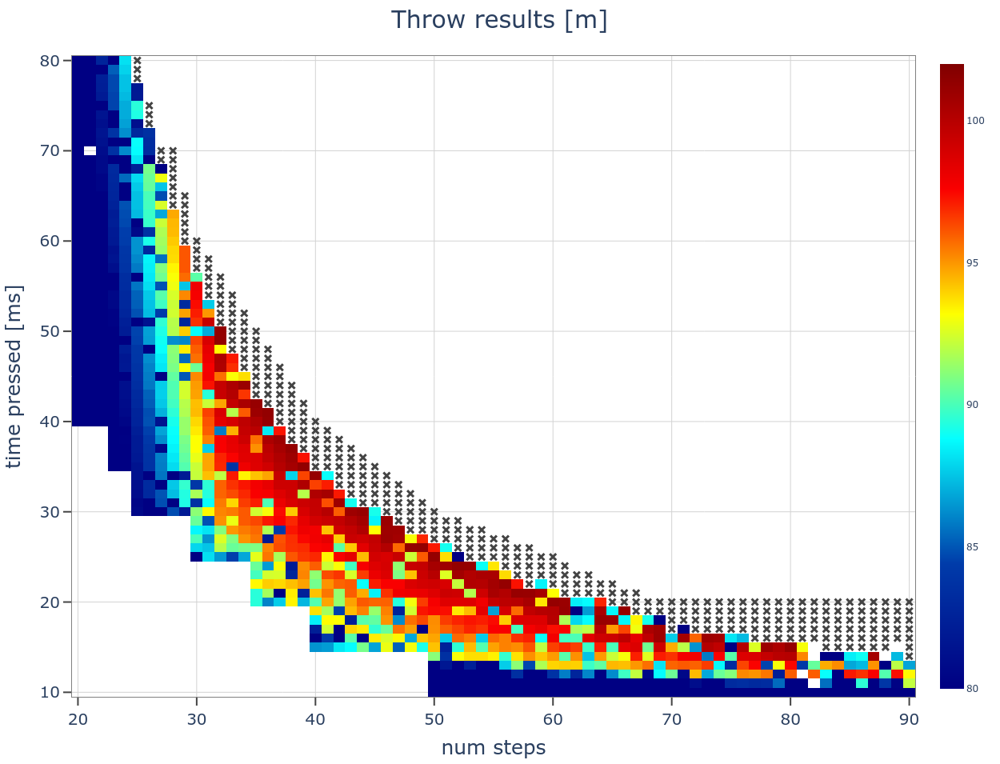

# Automate THEC64's *Javelin throw*

The goal of this project is to achieve the best possible result in *Javelin throw*, one of the events within *Summer Games II* on THEC64 (https://retrogames.biz/thec64), 
an emulator of the Commodore 64 computer.

Game controls are explained on https://www.c64-wiki.com/wiki/Summer_Games_II#Javelin_Throw.

The basic idea is to try a large number of different random combinations of **(a)** the number of steps, 
**(b)** the length of each step and **(c)** the throwing angle and check which one gives the best result.


## How it works
 
The program does the following in an infinite loop:
* randomly choose the number of steps, the length of each step and the throwing angle
* send those parameters to THEC64
* capture video output from THEC64
* wait for the attempt to finish and read the result
* save the video to disk and the result in a csv file


### Sending commands from the PC to THEC64
THEC64 is a Linux machine running a C64 emulator. Its joystick is recognised as a USB human interface device (HID).

It is not possible to directly connect two Linux machines (PC and THEC64) with a USB cable and, even if it was possible, the PC wouldn't be 
recognised as a HID device. What we need is an Arduino with HID functionality, e.g. Arduino Pro Micro. 

We'll connect the Arduino to THEC64 with a USB cable.
Because the Arduino has only one USB port, we'll use a USB to TTL converter to connect PC's USB port with the Arduino's serial port.


### Sending video from THEC64 to the PC
Laptop's HDMI port does not support video input. We'll use a HDMI to USB video capture card and access the video stream via a `/dev/video{device_id}` device.


## Hardware

* THEC64: https://retrogames.biz/thec64
* Arduino Pro Micro or any board based on a microcontroller with an integrated USB controller, e.g. on ATmega32U4
* a USB to TTL converter, e.g. based on CH340G
* a HDMI to USB video capture card, e.g. Wiistar USB Video Capture Card: http://www.wiistar.com/english.php?m=goods&a=details&content_id=286


## Installation

### Hardware connections
Connect the USB to TTL converter's GND, RXD and TXD pins to Arduino Pro Micro's GND, TXO and RXI, respectively.


### PC
* Create a Python>=3.8 virtual environment
* Install packages from `src/requirements.txt`
* Find the USB to TTL converter's device name. `python -m serial.tools.list_ports` or `ls /dev/ttyUSB*` may be useful.
* Find the USB video capture card's device ID. `v4l2-ctl --list-devices` (from `v4l-utils` package) or `ls /dev/video*` may be useful. 
  <br/>
  Make sure that the device supports the MJPG format with the resolution of 1280x720 px at 20 fps. 
  `v4l2-ctl --device /dev/video{device_id} --list-formats-ext` can be used to list all supported formats.


### Arduino
* Install libraries listed in `arduino/libraries.txt`:
  * `Joystick`: version 1 is needed
* Upload sketch


### THEC64
In order to make Arduino recognised as a HID device, `/usr/share/the64/ui/data/gamecontrollerdb.txt` needs to contain a line for
this specific Arduino model. We'll use `TheC64-X-Windows v3.zip` from https://thec64community.online/thread/487/thec64-windows-mod 
to get access to THEC64's file system and append the needed line to the game controller mappings file.

The mapping entry format is described on https://github.com/gabomdq/SDL_GameControllerDB#create-new-mappings.
SDL2 Gamepad Tool (https://www.generalarcade.com/gamepadtool/) may be used to easily get Arduino's GUID without the need to parse `dmesg` output. 
Getting the correct button/axis mappings might require a trial-and-error approach. In my case the line to be added was:
```
03000000412300003780000001010000,Arduino Micro,righttrigger:b1,leftx:a0,lefty:a1,platform:Linux,
```
We only need to map the fire button and left and down joystick positions.


## Usage

### Interactive mode &mdash; [`src/interactive.py`](src/interactive.py)
Useful for testing and data exploration.
```
Usage: interactive.py -p SERIAL_PORT -d VIDEO_DEVICE_ID -o OUT_DIRNAME
    -p SERIAL_PORT, --port SERIAL_PORT
        Serial device name, e.g. "/dev/ttyUSB0"
    -d VIDEO_DEVICE_ID, --video-device-id VIDEO_DEVICE_ID
        Video device ID
    -o OUT_DIRNAME, --out-dir OUT_DIRNAME
        Directory to store runlog and replays
```

Available commands:
* **`w`, `s`, `a`, `d`:** move joystick up, down, left and right, respectively; useful for navigating the main menu
* **`f`:** (f)ire
* **`r {command}`:** (r)un<br/>
  `command` format: `fi,si,steps,fr,sr,st,lt`
  * **`fi`:** initial fire button press [ms]; -1 if not pressed at all
  * **`si`:** initial skip [ms]
  * **`steps`:** number of steps
  * **`fr`:** length of each step (fire button press) [ms]
  * **`sr`:** skip after each step (except last) [ms]
  * **`st`:** skip before throw [ms]
  * **`lt`:** throw length (joystick in the left position) [ms]<br/>
  e.g. `-1,500,30,55,55,0,400` &mdash; 30 steps of 55 ms each, throw of 400 ms
* **`l`:** execute (l)ast run command
* **`p`:** (p)repare for the next run (skip to the start screen)
* **`q`, `EOF`:** (q)uit


### Continuous mode &mdash; [`src/run.py`](src/run.py)
Process throws with random parameters in an infinite loop.
```
Usage: run.py -p SERIAL_PORT -d VIDEO_DEVICE_ID -o OUT_DIRNAME
    -p SERIAL_PORT, --port SERIAL_PORT
        Serial device name, e.g. "/dev/ttyUSB0"
    -d VIDEO_DEVICE_ID, --video-device-id VIDEO_DEVICE_ID
        Video device ID
    -o OUT_DIRNAME, --out-dir OUT_DIRNAME
        Directory to store runlog and replays
```

Parameter ranges:
* **number of steps:** between 20 and 90
* **length of each step:** between 10 and 80 ms, depending on the chosen number of steps
* **throw length:** between 300 and 500 ms


## Results

In total, using `src/run.py`, 13,000 attempts have been made, out of which 10,000 were successful. Runlog is in [`results/data/runlog.csv`](results/data/runlog.csv).

`results/show_results.py RUNLOG_FILENAME` creates a heatmap plot from the results saved in the runlog file.



The distribution seems to be making sense, with the best results when choosing somewhere between 30 and 60 steps, each one between 20 and 50 ms long. 
The best result was 101.31 m. There have been 1,400 attemps of at least 90 m, 134 of at least 100 m, 41 of at least 101 m and 8 equal to 101.31 m.

https://user-images.githubusercontent.com/32217494/138312099-b250b9df-c2ef-4aed-85a8-13ff64ad9712.mp4


## Summary

It might have been easier to install the VICE emulator (https://vice-emu.sourceforge.io/) on the PC and control the keyboard/joystick using 
some GUI automation library, like PyAutoGUI (https://github.com/asweigart/pyautogui). 

The result of 101.31 m seems to be the highest one possible. There are records of other players reaching this distance on https://www.twingalaxies.com/game/summer-games-ii/commodore-64/emu-javelin-meters/.

